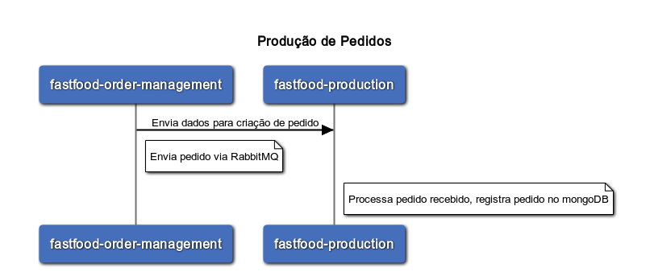

# fastfood-production
Serviço para controle de produção do fastfood


- Gestão de pedidos para produção
- Controle de status de pedido


### [Criação de Pedido](#Criação_de_Pedido)

***

#### **Listener Rabbit recebimento de pedidos**

Dados Pedido


Exemplo Payload :
```javascript
{
  "id": "e5e09e8d-a2c9-4ff3-82d6-2c36db28c982",
  "produtos": [
    {
      "id": "1",
      "nome": "Cheese Burger",
      "descricao": "pao, hamburguer, alface, queijo, molho especial",
      "preco": 15.5,
      "categoria": "LANCHE",
      "quantidade": 1
    }
  ],
  "cliente": {
    "nome": "Cliente Sobrenome",
    "cpf": {
      "numero": "123.456.789.09"
    },
    "email": {
      "endereco": "email@email.com"
    }
  },
  "pagamento": {
    "id": "e5e09e8d-a2c9-4ff3-82d6-2c36db28c982",
    "totalPagamento": 15.5,
    "tipoPagamento": "QR_CODE",
    "dataPagamento": "2024-01-23T21:58:51.326Z",
    "statusPagamento": "PROCESSANDO"
  },
  "status": "RECEBIDO",
  "dataCriacaoPedido": "2024-01-23T21:58:51.326Z",
  "valorTotal": 15.5,
  "qrCode": "qrCode_url"
}
```
<br>



<br>

### [Grupo 7](#grupo-7)
***
* Jackson Carlos Leite Ramalho
* Valqueline Nicácio da Silva